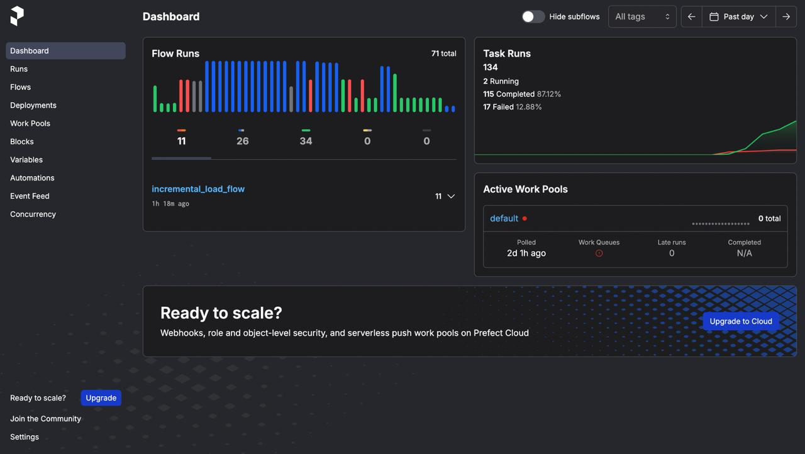
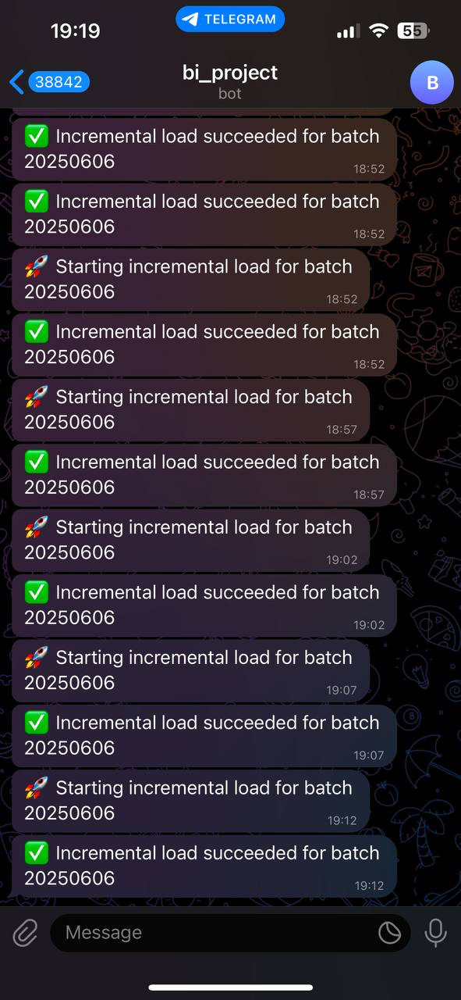

# BI Project v2

A Business Intelligence (BI) solution that ingests data from multiple sources (1 - relational database, 2 - csv file), applies Slowly Changing Dimension (SCD2) logic, populates a star schema, and provides interactive dashboards via Metabase. Scheduling and orchestration are handled by Prefect, and operational notifications (success/failure) are delivered via Telegram.

---

## Table of Contents

1. [Project Overview](#project-overview)  
2. [Prerequisites](#prerequisites)  
3. [Project Structure](#project-structure)  
4. [Getting Started](#getting-started)  
   - [Cloning & Environment Setup](#cloning--environment-setup)
5. [Data Generation & Initial Load](#data-generation--initial-load)  
   - [Generating Synthetic Data](#generating-synthetic-data)  
   - [Creating Warehouse & Star Schema](#creating-warehouse--star-schema)  
   - [Full ETL Load (Manual)](#full-etl-load-manual)  
6. [Incremental ETL & Prefect Flows](#incremental-etl--prefect-flows)  
   - [Prefect Flow Definition (`etl_flows.py`)](#prefect-flow-definition-etl_flowspy)  
   - [Running the Flow Locally (Serving)](#running-the-flow-locally-serving)  
   - [Sample Flow Run Output](#sample-flow-run-output)  
7. [Notifications (Telegram)](#notifications-telegram)  
   - [`notifications/telegram.py` Overview](#notificationstelegrampy-overview)  
8. [Visualization & Reporting (Metabase)](#visualization--reporting-metabase)  
   - [Connecting Metabase to PostgreSQL](#connecting-metabase-to-postgresql)  
   - [Building & Saving Questions](#building--saving-questions)  
   - [Creating Interactive Dashboards](#creating-interactive-dashboards)  
9. [References](#references)  

---

## 1. Project Overview

This project implements a typical BI workflow:

1. **Data Sources**  
   - A “source” PostgreSQL schema (tables: `users`, `courses`, `sales_managers`, `enrollments`, `sales`, `categories`, `subcategories`, `traffic_sources`, `user_traffic`).  
   - A CSV file (`data_sources/user_traffic.csv`) as a secondary "source". Which is basically represents the `user_traffic` table. Logically this is important, as company can have many marketing channels and marketing agencies can provide their statistics in this format.  

2. **Warehouse (SCD2)**  
   - Implements Slowly Changing Dimension Type‐2 logic for all source tables, storing history in `warehouse.*` tables. Moreover, it keeps historical data using 5 extra columns: `start_date`, `end_date`, `source_id_audit`, `insert_id`, `update_id`.

3. **Star Schema**  
   - Populates `star_schema.dim_user`, `star_schema.dim_course`, `star_schema.dim_sales_manager`, `star_schema.dim_traffic_source`, `star_schema.dim_date`, and `star_schema.fact_sales` (which re‐builds on every incremental run). Star schema is the heart of this project, as it is used for the analytical purposes.

4. **Orchestration**  
   - Prefect flows (`flows/etl_flows.py`) schedule and run incremental ETL every 5–30 minutes.  
   - Notifications to a Telegram chat on flow start, success, and failure.  
   - 
   - 

5. **Visualization**  
   - Metabase dashboards query the star schema live, with interactive filters on dimensions (e.g., course category, date range, country).
   - dashboard/BI_dashboard_1st_tab.pdf
   - dashboard/BI_dashboard_12nd_tab.pdf

Each piece is modular and can be run independently. Below, you’ll find detailed instructions and code snippets to replicate the entire pipeline.

---

## 2. Prerequisites

- **Python 3.9+**  
- **PostgreSQL 14+** (or compatible)  
- **SQLAlchemy 1.4+**  
- **Prefect 3.x**  
- **Requests** (for Telegram API calls)  
- **Metabase** (v0.45+ recommended)  
- **Docker & Docker Compose** (optional, for spinning up Postgres + Metabase)

Please ensure your local environment meets these minimum requirements before proceeding.

---

## 3. Project Structure

At a high level, the workflow is:

1. **`data_generation/`**:  
   - `populate_db.py` → Populates the **source** Postgres with synthetic users, courses, enrollments, sales, traffic sources, etc.  
   - `clear_db.py`, `clear_warehouse.py`, and `clear_star_schema.py` → Utility scripts to truncate/reset schemas.  

2. **`warehouse/`**:  
   - `create_warehouse.db.py` → Creates the `warehouse` schema (dimension tables + SCD2 logic).  
   - `create_star_schema.py` → Creates the `star_schema` out of the `warehouse` tables.  
   - `etl.py` → Combines SCD2‐style inserts/updates into the warehouse, then rebuilds the star schema (including `fact_sales`, dimension tables).  

3. **`flows/etl_flows.py`**:  
   - Defines Prefect flows for **initial** and **incremental** loads (`incremental_load_flow`, `deploy_initial`, `deploy_incremental`).  

4. **`data_sources/`**:  
   - Contains CSV files (`user_traffic.csv`) and helper modules (`model.py`, `rdbms.py`) for creation **source** database.  

5. **`notifications/telegram.py`**:  
   - Implements a lightweight Telegram‐bot wrapper to send notifications when an incremental load completes (you’ll need to supply your own Bot Token + Chat ID).  

6. **`dashboard/`**:  
   - Two pre‐generated PDF files (`BI_dashboard_1st_tab.pdf`, `BI_dashboard_2nd_tab.pdf`) that showcase example charts (e.g. revenue by quarter, traffic‐source pivot, top‐selling courses).  

7. **`docker-compose.yml`**:  
   - Connects the entire project to the Metabase.  

---

## 4. Getting Started

Follow these steps to clone the repo, configure your environment, and run everything end‐to‐end.

### 4.1 Cloning & Environment Setup

1. **Clone the Repository**

   ```bash
   git clone https://github.com/<your-username>/BI_project.v2.git
   cd BI_project.v2
   
## 5. Data Generation & Initial Load

### 5.1 Generating Synthetic Data

1. **Create Source Schema & Tables**  
   - Use `data_generation/model.py` and `data_generation/rdbms.py` to define the “source” schema and tables.  
   - Example:
     ```bash
     python data_generation/model.py    # Creates source tables in PostgreSQL
     ```

2. **Populate Synthetic Rows**  
   - Run `populate_db.py` to insert synthetic data into the source schema (`users`, `courses`, `sales_managers`, `enrollments`, `sales`, `categories`, `subcategories`, `traffic_sources`, `user_traffic`).  
   - Example:
     ```bash
     python data_generation/populate_db.py
     ```

3. **Verify Source Tables**  
   - Connect to PostgreSQL and confirm that rows exist:
     ```bash
     psql -U postgres -d bi_project
     ```
     ```sql
     SELECT COUNT(*) FROM source.users;
     SELECT COUNT(*) FROM source.user_traffic;
     \q
     ```

---

### 5.2 Creating Warehouse & Star Schema

1. **Create `warehouse` Schema**  
   - Run the DDL script:
     ```bash
     python warehouse/create_warehouse_db.py
     ```
   - This will create the following tables in `warehouse` schema (all using SCD2 columns: `start_date`, `end_date`, `source_id_audit`, `insert_id`, `update_id`):
     - `warehouse.users`  
     - `warehouse.sales_managers`  
     - `warehouse.courses`  
     - `warehouse.enrollments`  
     - `warehouse.sales`  
     - `warehouse.traffic_sources`  
     - `warehouse.user_traffic`

2. **Create `star_schema`**  
   - Run the DDL script:
     ```bash
     python warehouse/create_star_schema.py
     ```
   - This will create:
     - `star_schema.dim_user`  
     - `star_schema.dim_course`  
     - `star_schema.dim_sales_manager`  
     - `star_schema.dim_traffic_source`  
     - `star_schema.dim_date`  
     - `star_schema.fact_sales`

---

### 5.3 Full ETL Load (Manual)

1. **Run Full‐Load Command**  
   - Execute the full-load logic in `warehouse/etl.py` (batch_id = 1):
     ```bash
     python warehouse/etl.py full
     ```
   - Expected console output:
     ```
     [2025-06-06 15:00:00+00:00] ▶️  Starting FULL load (batch_id=1)

        • truncated all warehouse + star_schema tables

        • loaded warehouse.users
        • loaded warehouse.sales_managers
        • loaded warehouse.courses
        • loaded warehouse.enrollments
        • loaded warehouse.sales
        • loaded warehouse.traffic_sources
        • loaded warehouse.user_traffic from source.user_traffic (source_id_audit=1)
        • loaded warehouse.user_traffic from CSV (source_id_audit=2)

        • loaded star_schema.dim_user
        • loaded star_schema.dim_course
        • loaded star_schema.dim_traffic_source
        • loaded star_schema.dim_sales_manager
        • loaded star_schema.dim_date (XXX days from YYYY-MM-DD to YYYY-MM-DD)
        • loaded star_schema.fact_sales

     [2025-06-06 15:00:30+00:00] ✅ FULL load complete.
     ```
2. **Verify Results**  
   - Connect to PostgreSQL and confirm `warehouse.*` and `star_schema.*` tables are populated.

---

## 6. Incremental ETL & Prefect Flows

### 6.1 Prefect Flow Definition (`etl_flows.py`)

In `flows/etl_flows.py`, the flow is defined as follows:

```python
import sys
import os
from datetime import date
from prefect import flow, task
from warehouse.etl import run_incremental_load
from notifications.telegram import send_telegram_message

@task(name="notify_start", retries=0, retry_delay_seconds=0, log_prints=True)
def notify_start(batch_id: int):
    token   = os.getenv("TELEGRAM_BOT_TOKEN")
    chat_id = os.getenv("TELEGRAM_CHAT_ID")
    message = f"🚀 Starting incremental load for batch {batch_id}"
    try:
        send_telegram_message(message, bot_token=token, chat_id=chat_id)
    except Exception as e:
        print(f"[notify_start] Telegram error: {e}")

@task(name="incremental_load_task", retries=1, retry_delay_seconds=300, log_prints=True)
def incremental_load(batch_id: int):
    run_incremental_load(batch_id)
    return f"Incremental load completed for batch {batch_id}"

@task(name="notify_success", retries=0, retry_delay_seconds=0, log_prints=True)
def notify_success(batch_id: int):
    token   = os.getenv("TELEGRAM_BOT_TOKEN")
    chat_id = os.getenv("TELEGRAM_CHAT_ID")
    message = f"✅ Incremental load succeeded for batch {batch_id}"
    try:
        send_telegram_message(message, bot_token=token, chat_id=chat_id)
    except Exception as e:
        print(f"[notify_success] Telegram error: {e}")

@task(name="notify_failure", retries=0, retry_delay_seconds=0, log_prints=True)
def notify_failure(batch_id: int, error_msg: str):
    token   = os.getenv("TELEGRAM_BOT_TOKEN")
    chat_id = os.getenv("TELEGRAM_CHAT_ID")
    message = f"❌ Incremental load FAILED for batch {batch_id}\nError: {error_msg}"
    try:
        send_telegram_message(message, bot_token=token, chat_id=chat_id)
    except Exception as e:
        print(f"[notify_failure] Telegram error: {e}")

@flow(name="incremental_load_flow")
def incremental_load_flow(execution_date: date = date.today()):
    batch_id = int(execution_date.strftime("%Y%m%d"))
    # 1) Notify start
    notify_start(batch_id)

    # 2) Run ETL
    try:
        msg = incremental_load(batch_id)
        notify_success(batch_id)
        print(msg)
    except Exception as e:
        err = str(e)
        notify_failure(batch_id, err)
        raise

if __name__ == "__main__":
    incremental_load_flow.serve(
        name="incremental-load-every-5m",
        interval=300,            # 5 minutes
        tags=["bi_project"],
        pause_on_shutdown=False,
    )
```
### Sample console output:

```p
17:45:00 | INFO    | PrefectOS | Starting local server on http://127.0.0.1:8187
Runner 'incremental-load-every-5m' submitting flow run 'abcd1234-5678-90ef-ghij-klmnopqrst'
17:45:01 | INFO    | Flow run 'abcd1234' - Downloading flow code from storage at '.'
17:45:02 | INFO    | Flow run 'abcd1234' - Beginning flow run 'incremental_load_flow'
17:45:03 | INFO    | Task run 'notify_start-xyz' - Finished in state Completed()
17:45:03 | INFO    | Task run 'incremental_load_task-abc' - [2025-06-06 15:45:03+00:00] ▶️  Starting INCREMENTAL load (batch_id=20250606)
17:45:15 | INFO    | Task run 'incremental_load_task-abc' -    • inserted new warehouse.users
...
17:45:30 | INFO    | Task run 'incremental_load_task-abc' - Task run completed successfully
17:45:31 | INFO    | Task run 'notify_success-uvw' - Finished in state Completed()
```

## 7. Notifications (Telegram)

### 7.1 notifications/telegram.py Overview

```Python
import os
import requests
from typing import Optional

TELEGRAM_API_BASE = "https://api.telegram.org"

def send_telegram_message(
    text: str,
    bot_token: Optional[str] = None,
    chat_id: Optional[str] = None,
) -> None:
    """
    Send a text message to a Telegram chat. If bot_token or chat_id is not provided,
    it will fetch them from environment variables TELEGRAM_BOT_TOKEN and TELEGRAM_CHAT_ID.
    """
    BOT_TOKEN = bot_token or os.getenv("TELEGRAM_BOT_TOKEN")
    CHAT_ID  = chat_id  or os.getenv("TELEGRAM_CHAT_ID")

    if not BOT_TOKEN or not CHAT_ID:
        raise RuntimeError("Missing TELEGRAM_BOT_TOKEN or TELEGRAM_CHAT_ID environment variables.")

    url = f"{TELEGRAM_API_BASE}/bot{BOT_TOKEN}/sendMessage"
    payload = {"chat_id": CHAT_ID, "text": text}

    response = requests.get(url, params=payload, timeout=10)
    if not response.ok:
        raise RuntimeError(f"Failed to send Telegram message: {response.status_code} {response.text}")

```
- Reads tokens from environment variables unless overridden in arguments.

- Sends an HTTP GET to Telegram’s sendMessage endpoint.

## 8. Visualization & Reporting (Metabase)

### 8.1 Connecting Metabase to PostgreSQL
1) Open Metabase at http://localhost:3000 (Docker Compose) or your configured host/port.

2) Complete the onboarding wizard:

3) Create an admin account.

4) When prompted for a database, select PostgreSQL and enter:

- Host: db (Docker Compose) or localhost

- Port: 5432

- Database name: bi_project

- Username: postgres (or bi_user)

- Password: admin (or bi_password)

- Click Save.

- Metabase will scan all schemas, including star_schema, making them available under “Datasets.”

## 10. References
1) Prefect Documentation: https://docs.prefect.io/

2) SQLAlchemy Documentation: https://docs.sqlalchemy.org/

3) PostgreSQL Documentation: https://www.postgresql.org/docs/

4) Metabase Documentation: https://www.metabase.com/docs/

5) Telegram Bot API (sendMessage): https://core.telegram.org/bots/api#sendmessage
